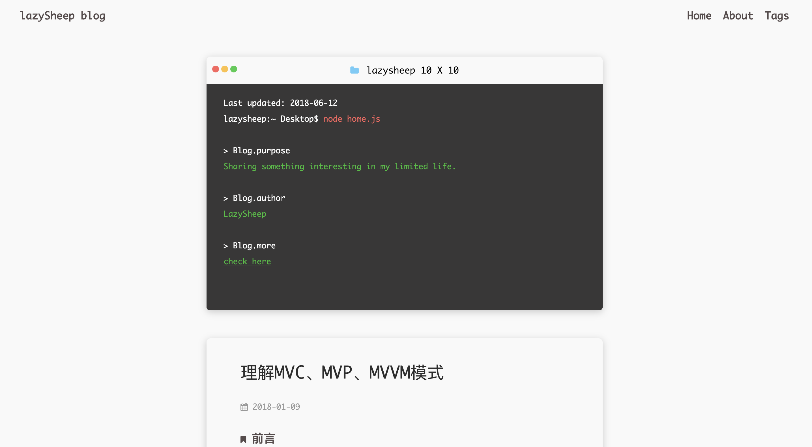

## A theme based on hexo

### Usage

- Due to the template is based on the **pug**，making sure that you have installed the **hexo-renderer-jad** by `npm install --save-dev hexo-renderer-jade`.

- You need to create two pages-**about** and **tags**-by `hexo new page <title>`.

- The **config file** is `_config.yml`.

### Preview

### Live Demo

[blog.lazysheep.fun](https://lazysheep666.github.io)
